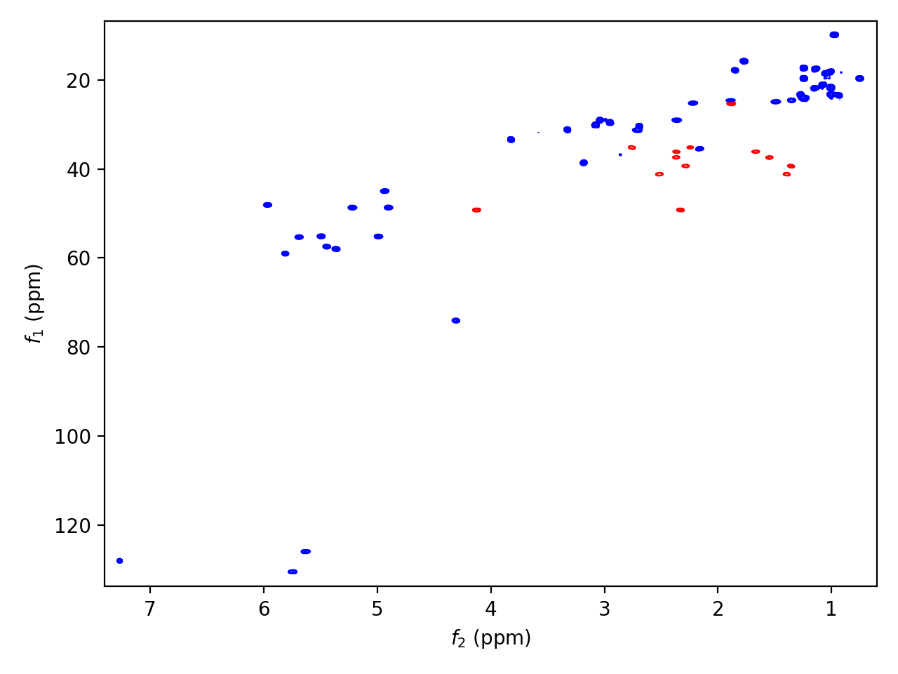

.. penguins documentation master file, created by
   sphinx-quickstart on Wed Jun 10 13:21:50 2020.
   You can adapt this file completely to your liking, but it should at least
   contain the root `toctree` directive.

.. |penguin| replace:: 🐧

Welcome to penguins!
====================

|penguin| *Penguins: an Easy and NullPointerException-free Gateway to Unpacking and Illustrating NMR Spectra* |penguin|

::

   import penguins as pg

   example_spec = pg.read("data/exam2d_HC/", 3, 1)
   pg.plot2d(example_spec,
             contour_levels=(1e6, None, None),
             contour_colors=("blue", "red")),
             bounds=((133.8, 6.8), (7.4, 0.6))
             )
   pg.show()

Contents
========

.. toctree::
   :maxdepth: 2
   
   install
   quickstart
   topspin
   plot
   reference

* :ref:`genindex`
* :ref:`search`
