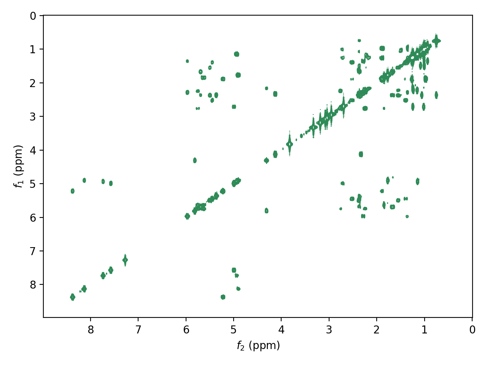

.. penguins documentation master file, created by
   sphinx-quickstart on Wed Jun 10 13:21:50 2020.
   You can adapt this file completely to your liking, but it should at least
   contain the root `toctree` directive.

.. |penguin| replace:: 🐧

Welcome to penguins!
====================

|penguin| *Penguins: an Easy and NullPointerException-free Gateway to Unpacking and Illustrating NMR Spectra* |penguin|

::

   import penguins as pg

   example_spec = pg.read("/opt/topspin4.0.8/examdata/exam2d_HH/", 1, 1)
   example_spec.stage(bounds=((9, 0), (9, 0)),
                      colors=("seagreen", "hotpink"),
                      levels=(5e4, None, None)
                      )
   pg.plot(); pg.show()

Contents
========

.. toctree::
   :maxdepth: 2
   
   install
   quickstart
   topspin
   plot
   reference

* :ref:`genindex`
* :ref:`search`
