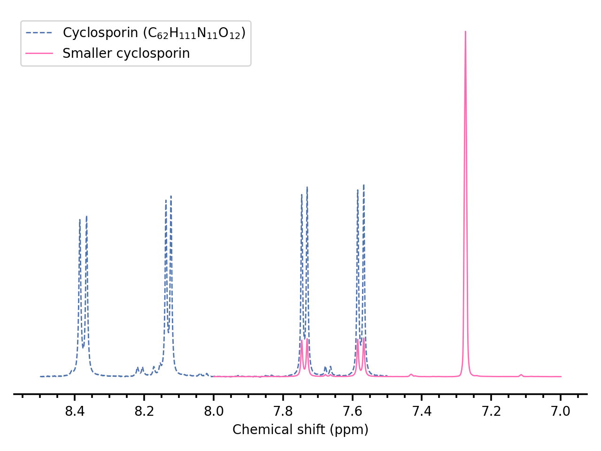
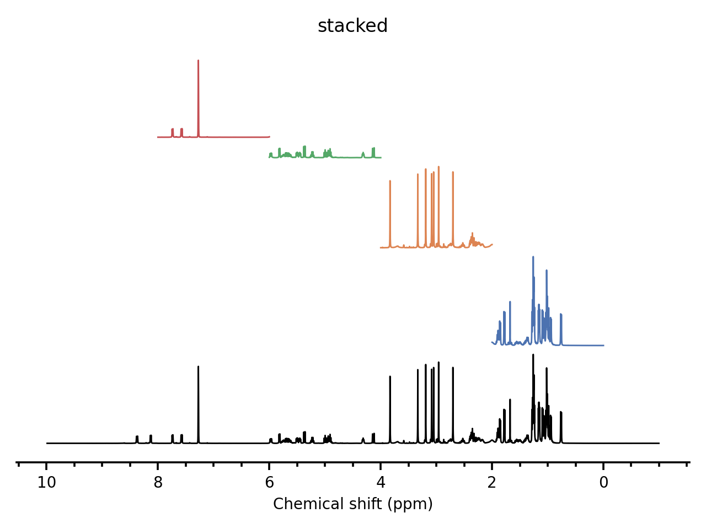
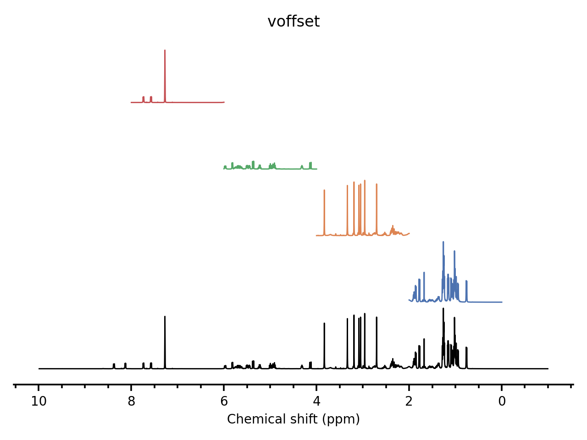

1D Plotting in Detail
=====================

As described in :doc:`quickstart`, routine plotting of spectra can be done fairly easily. This page aims to describe the various options available when plotting spectra.

The options here are applicable to all 1D datasets (:class:`~penguins.dataset.Dataset1D`, :class:`~penguins.dataset.Dataset1DProj`, and :class:`~penguins.dataset.Dataset1DProjVirtual`).

Step 1: Staging spectra
-----------------------

Firstly, it should be noted that the :meth:`stage()` methods on 1D dataset classes simply call :func:`penguins.pgplot.stage1d()` on the Dataset object itself, with all the arguments passed along. Therefore, if ``ds`` is a 1D dataset object, the following invocations are entirely equivalent (although the former is easier to type)::

   ds.stage(*args, **kwargs)
   pg.pgplot.stage1d(ds, *args, **kwargs)

Multiple spectra can be plotted by staging each of them individually.

.. currentmodule:: penguins.pgplot

.. function:: stage1d(dataset[, scale=None[, bounds=None[, label=None[, color=None[, plot_options=None]]]]])

   Penguins maintains a *"holding area"*, which is a global list of plots which have been registered but not yet plotted. The :func:`~penguins.pgplot.stage1d()` function uses the information provided to create a :class:`~penguins.pgplot.PlotObject1D` object, which is then appended to that list.

   :param dataset: A 1D dataset object.
   :param scale: *(optional)* Indicates factor to scale spectrum intensity by.
   :type scale: float
   :param bounds: *(optional)* A tuple of floats ``(upper, lower)`` specifying the section of the spectrum to plot. Both should be chemical shifts. If either ``upper`` or ``lower`` are none, then the upper (lower) bound is the leftmost (or rightmost) edge of the spectrum. If not provided, defaults to the entire spectrum.
   :param label: *(optional)* Text to be displayed in the plot legend. Some LaTeX-like syntax is possible using raw strings: see :std:doc:`tutorials/text/mathtext`.
   :type label: str
   :param color: *(optional)* A valid ``matplotlib`` color. See :std:doc:`matplotlib:tutorials/colors/colors` for more information. The default colour palette used is Seaborn's "deep" (see Seaborn's :std:doc:`seaborn:tutorial/color_palettes`).
   :type color: str
   :param plot_options: *(optional)* Key-value options which are passed on directly to :func:`plt.plot() <matplotlib.pyplot.plot>`. Note that the ``color`` and ``label`` parameters will override the corresponding keys in ``plot_options``, if present.
   :type plot_options: dict

   :returns: None.

::

   ds1 = pg.read("/opt/topspin4.0.8/examdata/exam1d_1H", 1, 1)
   
   # This label demonstrates some of the LaTeX capabilities.
   # The colour for this one defaults to the first item in Seaborn/deep.
   ds1.stage(bounds=(8.5, 7.5),     # NH protons only
             label=r"Cyclosporin (C$_{62}$H$_{111}$N$_{11}$O$_{12}$)",
             plot_options={"linestyle": '--'})

   # You can stage the same dataset multiple times with different options.
   ds1.stage(scale=0.2,
             bounds=(8, 7),
             label="Smaller cyclosporin",
             color="hotpink")

   pg.plot(); pg.show()

Step 2: Constructing the plot
-----------------------------

Plot construction is done using :func:`~penguins.pgplot.plot()`.

.. function:: plot([figstyle="default"[, stacked=False[, voffset=0[, hoffset=0[, title=None[, xlabel="Chemical shift (ppm)"[, ylabel="Intensity(au)"]]]]]]])

   Calls :func:`plt.plot() <matplotlib.pyplot.plot>` on each spectrum in the holding area. Also calls several matplotlib functions in order to make the plot more aesthetically pleasing.
   
   All keyword arguments below are optional:

   :param str figstyle: Specifies the overall plot style.

      * ``"default"`` removes all spines except the bottom one, enables minor ticks, and makes the axis slightly thicker.
      * ``"mpl_natural"`` does not change any settings from the original.

      There are no other styles right now, but this list may be expanded in future. In any case, this can later be customised further (see below).

   :param bool stacked: True to make spectra tightly stacked (i.e. not superimposed). Overrides any value given in the ``voffset`` parameter.

   :param float voffset: Fraction of maximum height to vertically offset spectra by. The height of a spectrum refers to the total width it spans in the *y*-axis, and the maximum height refers to the largest such height of all spectra in the holding area. This is useful for offsetting spectra by a *constant amount*. Note that stacked spectra have a *variable* vertical offset between each spectrum, because each spectrum will have a different height. An example of the difference is shown below.

   :param float hoffset: Amount of horizontal offset between adjacent spectra. If this is positive, then later spectra are right-shifted.

   :param str title: Plot title.

   :param str xlabel: Label for *x*-axis.

   :param str ylabel: Label for *y*-axis. This would never be used unless you use ``figstyle=mpl_natural``, or manually reenable the *y*-axis display.

   :returns: Tuple of (:py:class:`~matplotlib.figure.Figure`, :py:class:`~matplotlib.axes.Axes`) objects corresponding to the plot.

:func:`~penguins.pgplot.plot()` conveniently returns ``(fig, ax)``, so that you do not need to call :func:`plt.gcf() <matplotlib.pyplot.gcf>` or :func:`plt.gca() <matplotlib.pyplot.gca>`. Therefore you can carry out any other operations you wish to after this. For example, to set the figure size::

   fig, _ = pg.plot()    # _ denotes a throwaway variable
   fig.set_size_inches(6, 4)

Here is an example of a stacked plot versus one with ``voffset=1.1`` (the extra 0.1 to ensure that there is some padding between the spectra)::

   ds1 = pg.read("/opt/topspin4.0.8/examdata/exam1d_1H", 1, 1)
   ds1.stage(bounds=None, color="black")    # Full spectrum
   ds1.stage(bounds=(2, 0))                 # Four subspectra
   ds1.stage(bounds=(4, 2))
   ds1.stage(bounds=(6, 4))
   ds1.stage(bounds=(8, 6))
   pg.plot(stacked=True, title="stacked")   # Either this...
   pg.plot(voffset=1.1, title="voffset")    # ...or this
   pg.show()

In the *stacked* plot, the fourth spectrum (from the bottom; in green) occupies a relatively small vertical space, because its intensity is relatively low (does not have any large singlets).
However, in the *voffset* plot, it occupies the same vertical space as the other four spectra, because the vertical offset between spectra is a constant.
(Note that if ``voffset`` was set to exactly 1, then the two spectra at the bottom would touch each other; hence the recommendation of 1.1. When using ``stacked=True``, penguins also makes sure to add ``0.1 * maxheight`` extra padding between adjacent spectra.)
The question of which is *better* is left as a personal decision for the reader to make; it may well depend on the exact scenario!
