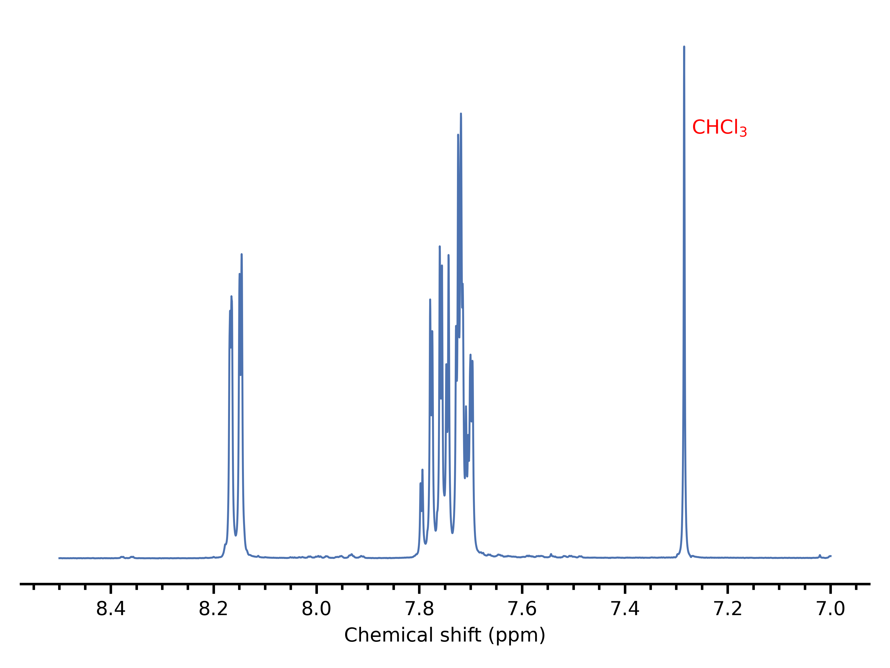
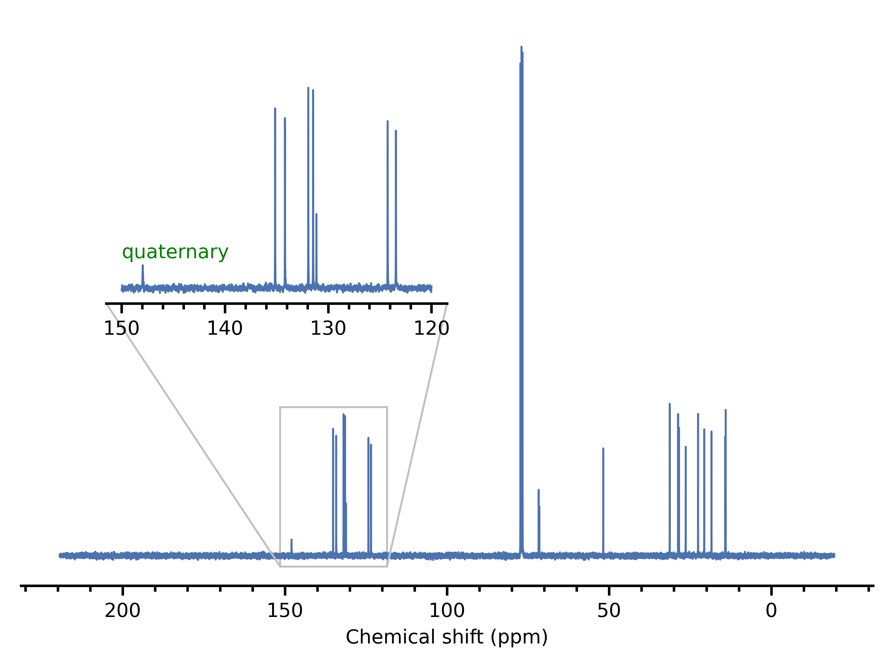
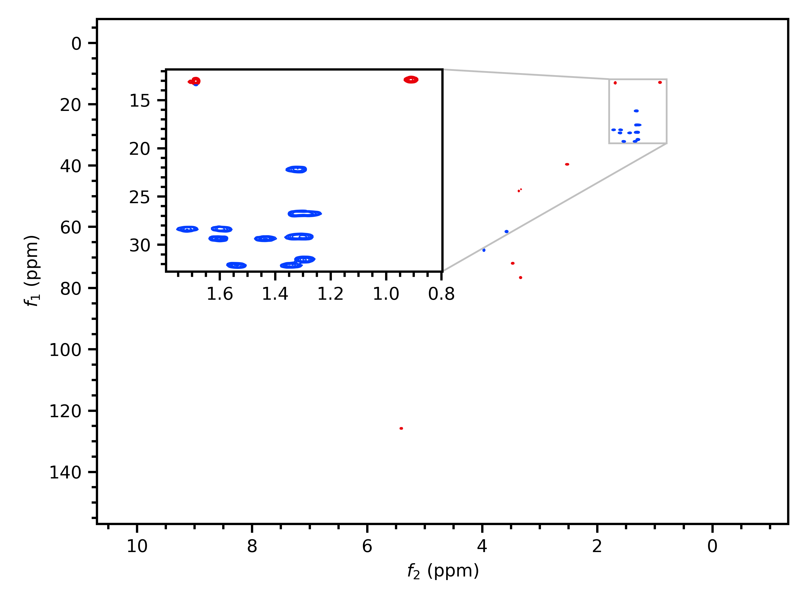
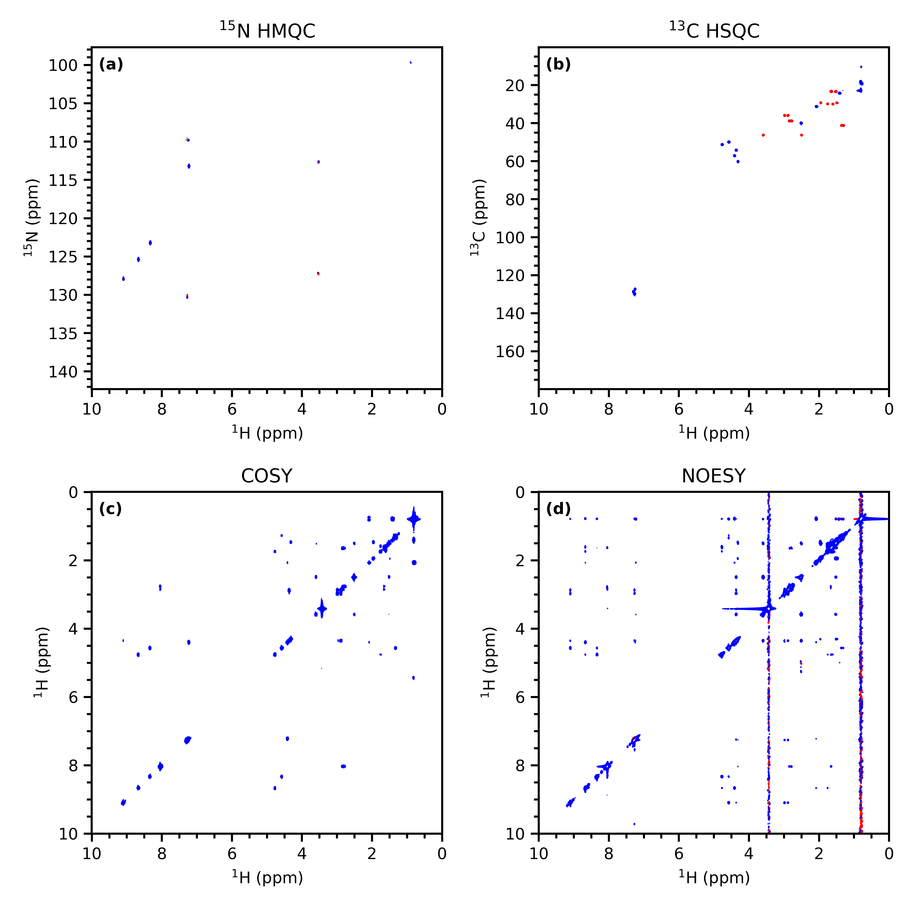
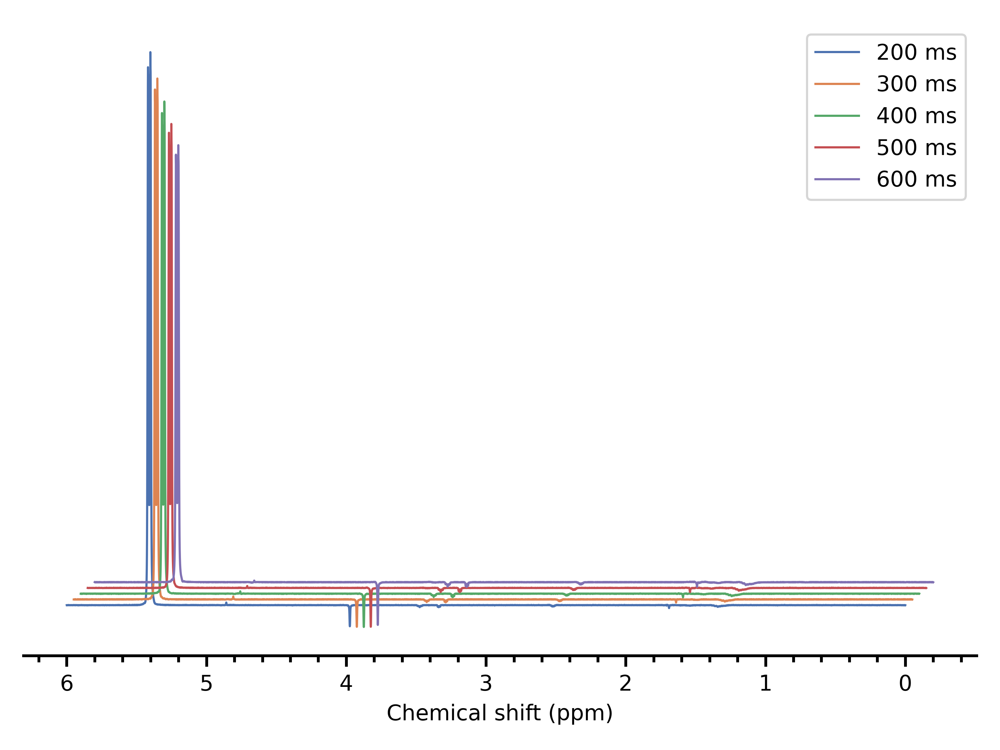
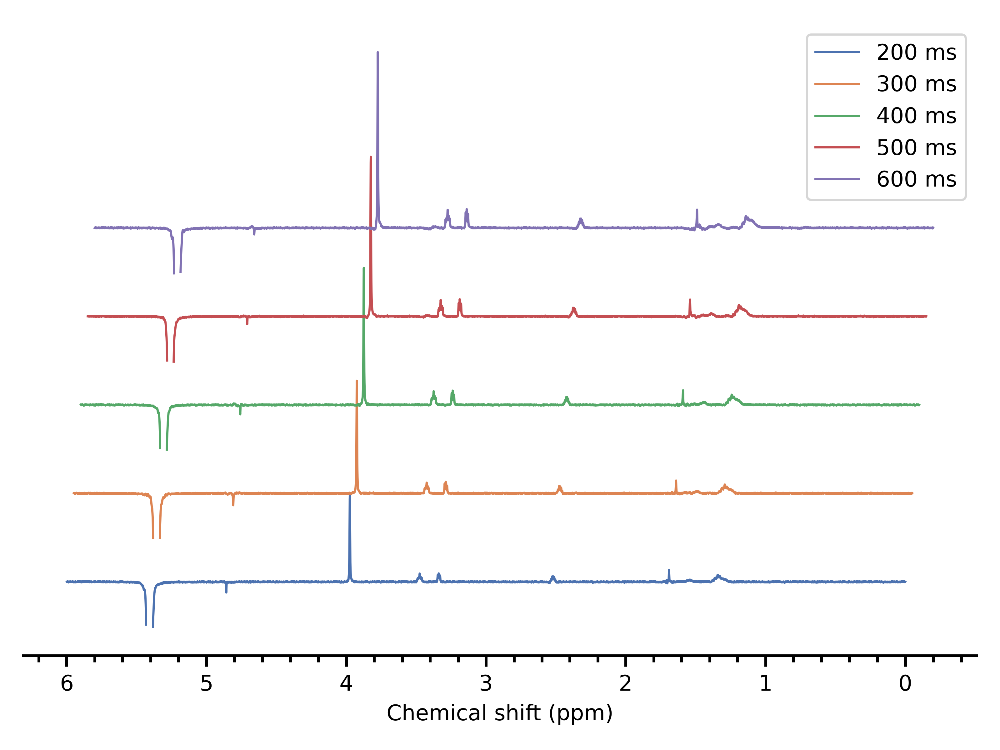
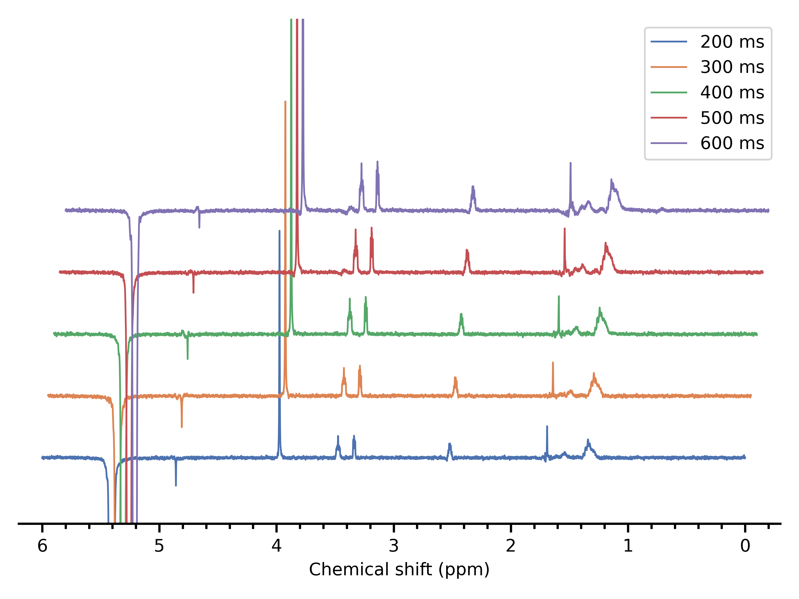
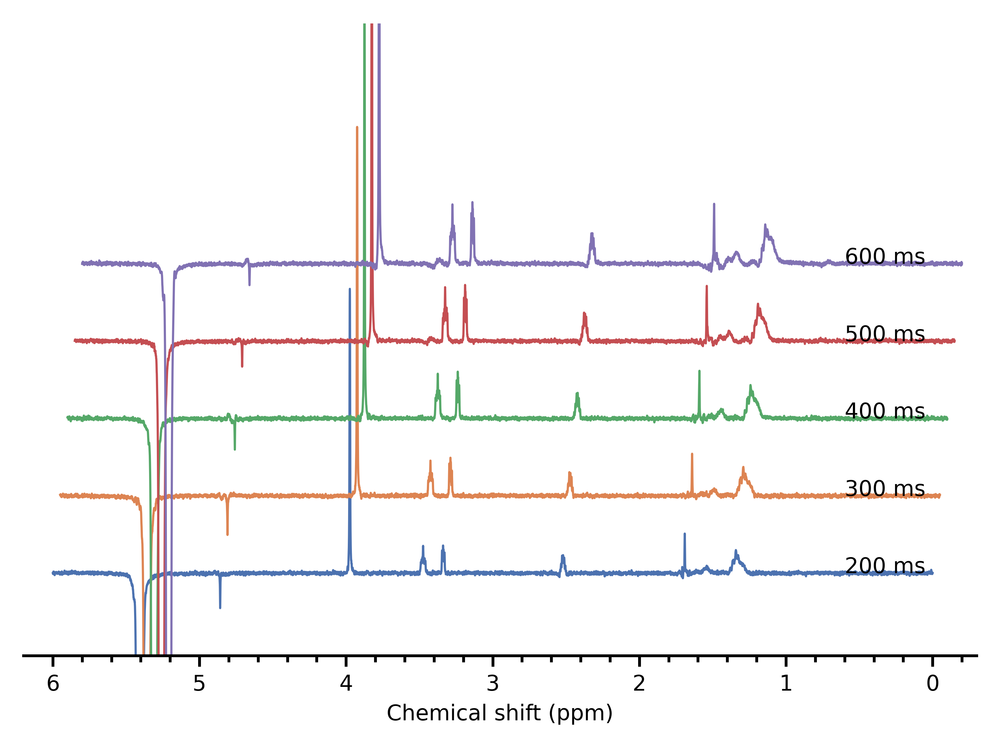
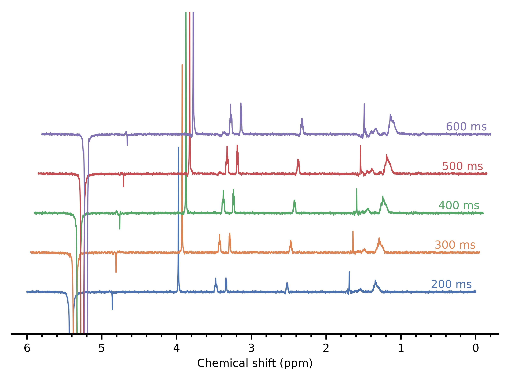

Plotting Cookbook
=================

This is a collection of more advanced topics in plotting.

Adding text to a spectrum
-------------------------

Adding text is best done using :meth:`ax.text() <matplotlib.axes.Axes.text>`. For example::

   ds = pg.read("data/pt2", 1, 1)
   ds.stage(bounds="7..8.5")
   _, ax = pg.mkplot()
   ax.text(x=7.27, y=0.8, s=r"$\mathrm{CHCl_3}$",
           color="red",
           transform=ax.get_xaxis_transform())
   pg.show()

The ``transform`` parameter above ensures that the *x*-coordinate is specified in terms of *data* coordinates (i.e. the actual chemical shift on the *x*-axis), whereas the *y*-coordinate is specified in terms of *axis* coordinates (i.e. bottom is 0 and top is 1). For 1D plots, the *y*-axis is the spectral intensity and spans several orders of magnitude, so without the transformation it is difficult to guess how high to place the text.

It turns out that for :meth:`ax.text() <matplotlib.axes.Axes.text>`, the default coordinate system is *data* coordinates along both axes (note that this is somewhat unusual for ``matplotlib``; it's far more normal for axis coordinates to be the default). So for 2D plots, you can simply leave out the ``transform`` parameter altogether and use ``ax.text(x=f2_ppm, y=f1_ppm, s="text")``.

For more information about transforms please see :std:doc:`tutorials/advanced/transforms_tutorial`.

Insets
------

Insets can be plotted using ``matplotlib``'s :meth:`ax.inset_axes <matplotlib.axes.Axes.inset_axes>` method.
As with many other things in ``matplotlib``, the interface is powerful but complicated. Thus, penguins provides a (hopefully slightly easier) :func:`~penguins.mkinset()` function which fulfils the same role as :func:`~penguins.mkplot`, but constructs an inset in the currently active plot.
An example will help to clarify this::

   ds = pg.read("data/pt2", 2, 1)  # 13C
   # Stage and plot it as usual. This is the parent plot.
   ds.stage(); pg.mkplot()
   # Then re-stage it with the appropriate bounds, and
   # use mkinset() instead of mkplot()
   ds.stage(bounds="120..150")
   inset_ax = pg.mkinset(pos=(0.1, 0.5), size=(0.4, 0.4),   # axis coordinates by default
                         parent_corners=("sw", "se"),  # 'sw' and 'southwest' both accepted
                         inset_corners=("sw", "se"))
   # mkinset() returns the inset Axes object, so you can use it
   # to do further customisation.
   inset_ax.text(x=150, y=0.2, s="quaternary",  # also it's adjacent to quadrupolar 14N
                 color="green",
                 transform=inset_ax.get_xaxis_transform())
   # Display as usual once you are done plotting.
   pg.show()

Full documentation for :func:`~penguins.mkinset()` will be provided in due course.

Here is a minimal example for a 2D spectrum::

   ds = pg.read("data/rot1", 3, 1)  # HSQC
   ds.stage(levels=3e5)
   pg.mkplot()
   ds.stage(f1_bounds="12..33", f2_bounds="0.8..1.8",
            levels=1.5e5)
   pg.mkinset(pos=(0.1, 0.5), size=(0.4, 0.4),
              parent_corners=("nw", "se"),
              inset_corners=("ne", "se"))
   pg.show()

Subplots
--------

Penguins also provides a wrapper around :func:`plt.subplots() <matplotlib.pyplot.subplots>`. Fundamentally, plotting in subplots is not significantly more complicated.
The main difference is that :func:`subplots()` returns an :class:`np.ndarray <numpy.ndarray>` of :class:`~matplotlib.axes.Axes` objects, and we need to make sure that we plot the correct spectrum on the correct set of ``Axes``.
This can be done by passing the appropriate :class:`~matplotlib.axes.Axes` instance to :func:`~penguins.mkplot()`.
A common technique is to assign the array of ``Axes`` to ``axs``, and then iterate over ``axs.flat``::

   # Create subplots
   _, axs = pg.subplots(2, 2)
   # Set up the lists.
   # 15N HMQC; 13C HSQC; COSY; NOESY
   spectra = [pg.read("data/noah", i, 1) for i in range(1, 5)]
   levels = [7e3, 2.3e4, 8.5e5, 8.9e4]
   titles = [r"$^{15}$N HMQC", r"$^{13}$C HSQC", "COSY", "NOESY"]
   clr = ("blue", "red")
   # Iterate over the lists.
   for spec, ax, lvl, title, char in zip(spectra, axs.flat, levels, titles, "abcd"):
       # Staging proceeds as normal
       spec.stage(levels=lvl, colors=clr)
       # Some fiddly manipulation of the nucleus strings
       f1, f2 = spec["nuc1"]              # ('15N', '1H')
       f1_elem = f1.lstrip("1234567890")  # N
       f1_mass = f1[:-len(f1_elem)]       # 15
       f2_elem = f2.lstrip("1234567890")  # H
       f2_mass = f2[:-len(f2_elem)]       # 1
       # When constructing the plot, you need to pass the correct axis instance
       pg.mkplot(axis=ax,
                 title=title,
                 xlabel=rf"$^{{{f2_mass}}}${f2_elem} / ppm",
                 ylabel=rf"$^{{{f1_mass}}}${f1_elem} / ppm")
       # Add a label. We're just showing off at this point.
       ax.text(x=0.02, y=0.97, s=f"({char})", transform=ax.transAxes,
               fontweight="semibold", verticalalignment="top")
    # Display as usual (outside the loop)
    pg.show()
 

Incidentally, we needed *three* sets of curly braces inside the ``xlabel`` and ``ylabel`` strings. One is for the f-string variable substitution; the other two get collapsed into one set of *literal* curly braces. The literal curly braces are needed for the LaTeX parser to superscript the entire mass number (or else we would end up with ``$^15$N``: :superscript:`1`\ 5N).

.. note::
   If you want to do anything using :func:`~penguins.get_properties`, you need to do it inside the loop, *before* :func:`~penguins.mkplot` is called again on the next iteration. Every call to :func:`~penguins.mkplot` resets the :class:`~penguins.PlotProperty` object.

A complete example
------------------

As a more complicated example, let's try to plot five 1D NOE spectra with different mixing times. This is what happens when we naively stage all of them::

   noes = [pg.read("data/rot1", i, 1) for i in range(10, 15)]
   for noe in noes:
       mixing_time = int(noe["d8"] * 1000)  # d8 itself is in seconds
       noe.stage(label=f"{mixing_time} ms",
                 bounds="0..6")
   pg.mkplot(voffset=0.01, hoffset=0.05)
   pg.show()

There are a couple of ways of stopping the intense on-resonance peak from dominating the spectrum. One way is to use the ``dfilter`` parameter of :meth:`~penguins.dataset.Dataset1D.stage()`. ``dfilter`` must be a function that takes the spectrum intensity at each point (a float) and returns ``True`` or ``False`` depending on whether we want the point or not. Here we use a ``lambda`` but you can define a proper function if you want. Also, if you prefer having the on-resonance peak negative, you can either reprocess in TopSpin or use ``scale=-1``, as below::

   noes = [pg.read("data/rot1", i, 1) for i in range(10, 15)]
   # Calculate the height of the intense peak
   maxheight = np.amax(noes[0].proc_data())
   for noe in noes:
       mixing_time = int(noe["d8"] * 1000)
       noe.stage(label=f"{mixing_time} ms",
                 bounds="0..6",
                 dfilter=(lambda i: i < 0.02 * maxheight),
                 scale=-1)
   # Note that the max heights of the staged spectra have changed,
   # so voffset needs to be adjusted as well.
   pg.mkplot(voffset=0.4, hoffset=0.05)
   pg.show()
                

As an alternative to that, you could just manually set the plot limits. When you display a graph, you can hover over the graph and ``matplotlib`` will tell you the coordinates of your current cursor position. Jot some good values down and pass them to :meth:`ax.set_xlim <matplotlib.axes.Axes.set_xlim>` and :meth:`ax.set_ylim <matplotlib.axes.Axes.set_ylim>`::

    noes = [pg.read("data/rot1", i, 1) for i in range(10, 15)]
    for noe in noes:
        mixing_time = int(noe["d8"] * 1000)
        noe.stage(label=f"{mixing_time} ms",
                  bounds="0..6",
                  scale=-1)
    _, ax = pg.mkplot(voffset=0.01, hoffset=0.05)
    ax.set_xlim(6.2, -0.3)   # must be (larger, smaller) so that it's inverted
    ax.set_ylim(-2.1e4, 1.4e5)
    pg.show()

Let's assume that we like this second option. The following discussion will apply to both, anyway, so you can tailor it to your liking.

If we wanted to display the mixing time next to each individual spectrum and not in the legend, then we just need to call :meth:`ax.text() <matplotlib.axes.Axes.text>` on an appropriate coordinate.
The *x*-coordinate is easy to choose, but the *y*-coordinate is not so easy, until we find :func:`~penguins.get_properties()`.
This returns a :class:`~penguins.pgplot.PlotProperties` class, which has an attribute ``voffsets`` listing the vertical offset of each spectrum in *data* coordinates::

   noes = [pg.read("data/rot1", i, 1) for i in range(10, 15)]
   for noe in noes:
       noe.stage(bounds="0..6", scale=-1)
   _, ax = pg.mkplot(voffset=0.01, hoffset=0.05)
   ax.set_xlim(6.2, -0.3)
   ax.set_ylim(-2.1e4, 1.4e5)
   # Get the vertical offset of each spectrum, in data coordinates
   voffsets = pg.get_properties().voffsets
   # Now add each bit of text at the appropriate voffset
   for voffset, noe in zip(voffsets, noes):
       mixing_time_label = f"{int(noe['d8'] * 1000)} ms"
       ax.text(x=0.6, y=voffset,
               s=mixing_time_label)
   pg.show()

Not bad, but the text needs to be lifted a little.
Now, :class:`~penguins.pgplot.PlotProperties` doesn't try to be overly clever with the values it stores, since it doesn't know what you want to use them for; it trusts that you will use them wisely.
In this case, all we need to do is to add some extra height (this bit pretty much *has* to be trial-and-error, since we don't want to hard-code a value).

We could also horizontally displace the text a little bit, just like the spectra, by subtracting the appropriate value of ``hoffset`` from each successive *x*-coordinate. Unsurprisingly, you can get the ``hoffsets`` (in ppm units) from ``PlotProperties.hoffsets``. And finally, we can reuse the colours of the original plot via ``PlotProperties.colors``::

   noes = [pg.read("data/rot1", i, 1) for i in range(10, 15)]
   for noe in noes:
       noe.stage(bounds="0..6", scale=-1)
   _, ax = pg.mkplot(voffset=0.01, hoffset=0.05)
   ax.set_xlim(6.2, -0.3)   # must be (larger, smaller)
   ax.set_ylim(-2.1e4, 1.4e5)
   # Get the properties of each spectrum
   voffsets = pg.get_properties().voffsets
   hoffsets = pg.get_properties().hoffsets
   colors = pg.get_properties().colors
   for color, voffset, hoffset, noe in zip(colors, voffsets, hoffsets, noes):
       mixing_time_label = f"{int(noe['d8'] * 1000)} ms"
       ax.text(x=(0.6 - hoffset), y=voffset+2e3,
               s=mixing_time_label,
               color=color)
   pg.show()

