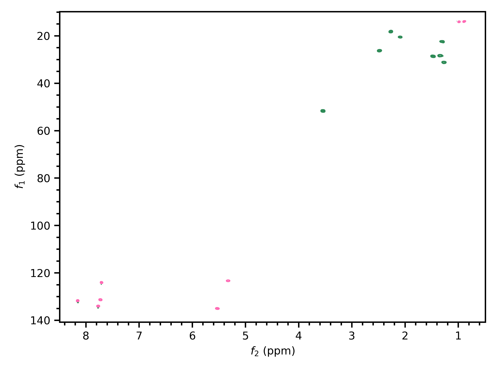

.. penguins documentation master file, created by
   sphinx-quickstart on Wed Jun 10 13:21:50 2020.
   You can adapt this file completely to your liking, but it should at least
   contain the root `toctree` directive.

.. |penguin| replace:: 🐧

Welcome to penguins!
====================

|penguin| *Penguins: an Easy and NullPointerException-free Gateway to Unpacking and Illustrating NMR Spectra* |penguin|

**Penguins** is a Python 3 package intended mainly for generating publication-quality plots of NMR spectra in a programmatic, reproducible fashion.

::

   pip install penguins  # this doesn't work yet: see "Installation"

At the time of writing, it only supports Bruker data. It has very limited spectral processing capabilities; the idea is that processing should be done in TopSpin or other software before plotting in penguins.

To get started, head over to the :doc:`quickstart` page. All code examples in the documentation, such as the following, can be run directly from the ``penguins/tests`` directory.

::

   import penguins as pg

   hsqc_dataset = pg.read("data/pt2", 3, 1)
   hsqc_dataset.stage(f1_bounds="10..141",
                      f2_bounds="0.5..8.5",
                      colors=("seagreen", "hotpink"),
                      levels=2e4)
   pg.mkplot()
   pg.show()

Contents
========

.. toctree::
   :maxdepth: 2
   
   install
   quickstart
   datasets
   paradigm
   plot1d
   plot2d
   cookbook
   nus
   topspin
   reference

* :ref:`genindex`
* :ref:`search`
