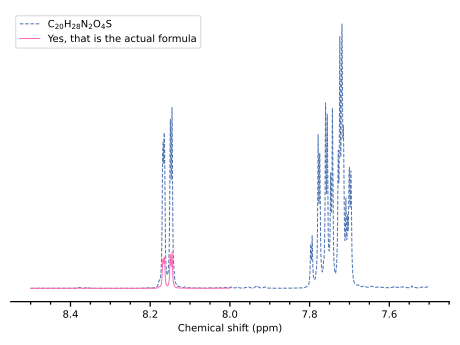
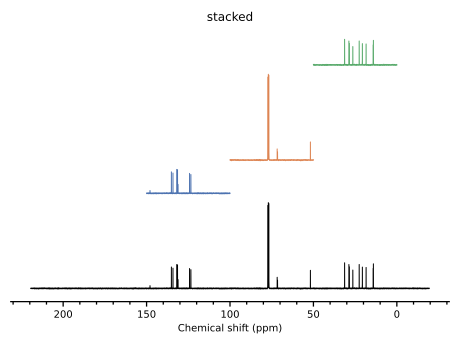
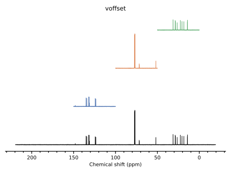

1D Plotting in Detail
=====================

As described in :doc:`quickstart`, routine plotting of spectra can be done fairly easily. This page aims to describe the various options available when plotting spectra.

The options here are applicable to all 1D datasets (:class:`~penguins.dataset.Dataset1D`, :class:`~penguins.dataset.Dataset1DProj`, and :class:`~penguins.dataset.Dataset1DProjVirtual`).

Step 1: Staging spectra
-----------------------

Firstly, it should be noted that the :meth:`stage()` methods on 1D dataset classes simply call :func:`penguins.pgplot._stage1d` on the Dataset object itself, with all the arguments passed along. Therefore, if ``ds`` is a 1D dataset object, the following invocations are entirely equivalent (although the former is easier to type)::

   ds.stage(*args, **kwargs)
   pg.pgplot.stage1d(ds, *args, **kwargs)

Multiple spectra can be plotted by staging each of them individually.

The documentation for :func:`~penguins.pgplot._stage1d` used to be here.

::

   ds1 = pg.read("data/pt2", 1, 1)
   
   # This label demonstrates some of the LaTeX capabilities.
   # The colour for this one defaults to the first item in Seaborn/deep.
   ds1.stage(bounds=(7.5, 8.5),
             label=r"$\mathrm{C_{20}H_{28}N_2O_4S}$",
             plot_options={"linestyle": '--'})

   # You can stage the same dataset multiple times with different options.
   ds1.stage(scale=0.2,           # 1/5 the height of first spectrum
             bounds=(8, 8.5),
             label="Yes, that is the actual formula",
             color="hotpink")

   pg.mkplot(); pg.show()

Step 2: Constructing the plot
-----------------------------

The documentation for :func:`~penguins.pgplot._mkplot1d` used to be here.

Here is an example of a stacked plot versus one with ``voffset=1.1``. The extra 0.1 is there to ensure that there is some padding between adjacent spectra (when using ``stacked``, penguins also makes sure to add ``0.1 * maxheight`` padding)::

   ds2 = pg.read("data/pt2", 2, 1)            # 13C spectrum
   ds2.stage(color="black")                   # No bounds => full spectrum
   ds2.stage(bounds="100..150")               # Three subspectra
   ds2.stage(bounds="50..100")
   ds2.stage(bounds="0..50")
   pg.mkplot(stacked=True, title="stacked")   # Either this...
   pg.mkplot(voffset=1.1, title="voffset")    # ...or this, but not both!
   pg.show()

In the ``stacked`` plot, the second spectrum (from the bottom; in blue) occupies a relatively small vertical space, because its intensity is relatively low (does not contain the large CDCl\ :subscript:`3` peak at 77 ppm).
However, in the ``voffset`` plot, it occupies the same vertical space as the other spectra, because the vertical offset between spectra is a constant.
The question of which is *better* is left as a personal decision for you to make. Indeed, you may find that different situations call for different settings.

.. _plot1d_display:

Step 3: Displaying the plot
---------------------------

For this step there are three major options:

1. Display the plot, and stop the script / interpreter from continuing until you close the figure window. This is done with |show|.

2. Save an image, using |savefig|. 

3. Display the plot but allow the script to continue (useful for e.g. real-time updates of a plot, or plotting in a loop). This is done with |pause|. (Although |show| has a ``block=False`` option, it doesn't seem to work on many systems.)

The :func:`show`, :func:`savefig`, and :func:`pause` wrappers used to be documented here.
