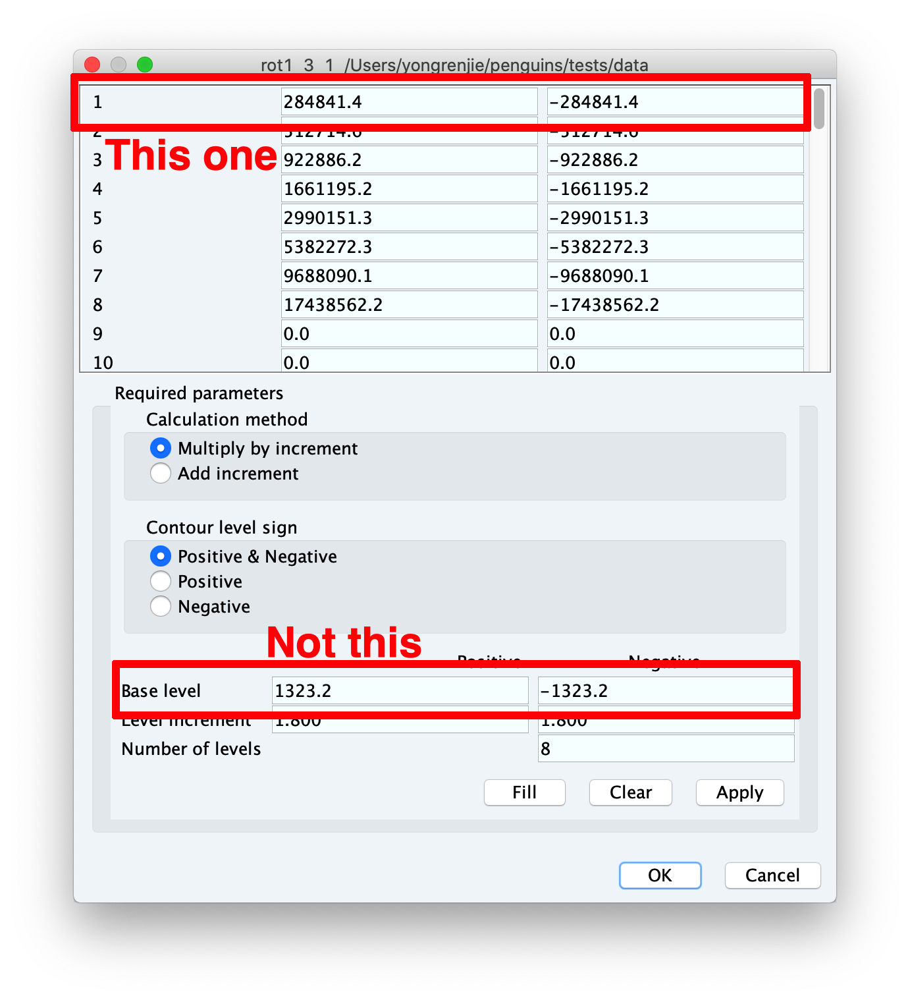
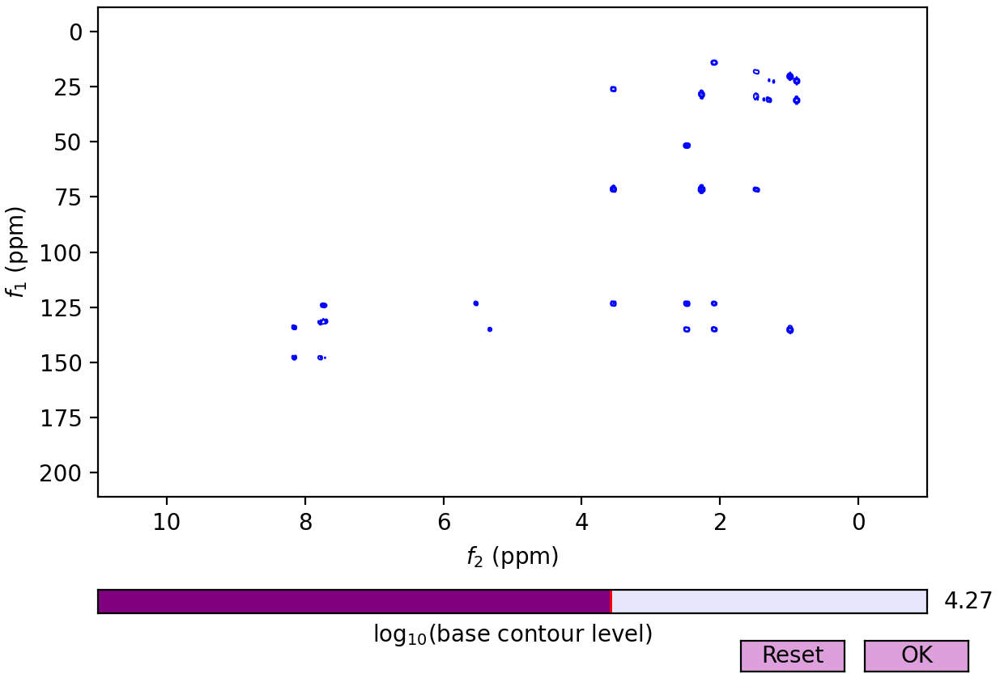
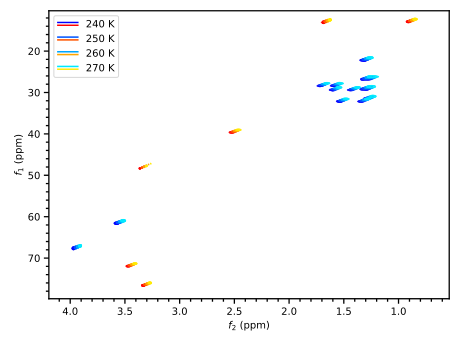

2D Plotting in Detail
=====================

Many concepts of the interface here are exactly analogous to that for 1D spectra, so will not be detailed here again.

Step 1: Staging spectra
-----------------------

Like its 1D counterpart, the :meth:`Dataset2D.stage <penguins.dataset.Dataset2d.stage>` method also delegates to :func:`penguins.pgplot.stage2d()`::

   # These are entirely equivalent
   ds2.stage(*args, **kwargs)    # ds2: a 2D dataset
   pg.pgplot.stage2d(ds2, *args, **kwargs)

..

The :func:`~penguins.pgplot._stage2d` full documentation used to be here.

As a slightly contrived example, here we stage the same HMBC dataset four times with different values of ``baselev``::

   d = pg.read("data/pt2", 5, 1)   # HMBC
   # Split spectrum into four portions
   bottom_f1, top_f1 = "100..", "..100"
   left_f2, right_f2 = "4.5..", "..4.5"
   # To make this less boring you could use a double listcomp or
   # itertools.product(), but for now we'll do it the repetitive way.
   # Recall levels=1e2 is the same as levels=(1e2, None, None).
   d.stage(f1_bounds=bottom_f1, f2_bounds=left_f2,  levels=1e2)
   d.stage(f1_bounds=top_f1,    f2_bounds=left_f2,  levels=1e3)
   d.stage(f1_bounds=bottom_f1, f2_bounds=right_f2, levels=1e4)
   d.stage(f1_bounds=top_f1,    f2_bounds=right_f2, levels=1e5)
   # Construct and display
   pg.mkplot(); pg.show()

.. image:: images/plot2d_baselev.svg
   :align: center

Notice that ``baselev`` in the bottom-left and top-left sectors are certainly too low; we are plotting mostly noise. The top-right sector with ``baselev=1e5`` doesn't pick up any noise, but the peaks are getting a little bit difficult to see. The best value of ``baselev`` is probably close to ``1e4`` as seen in the bottom-right. It turns out that TopSpin's algorithm suggests a value of approximately ``1.9e4``.

The next section contains more information about how to choose a base level.

.. _baselev:

Choosing base levels
--------------------

Choosing a base level for a 2D plot can be tricky. Even though the TopSpin algorithm is usually a decent initial guess, there is often a slightly better value. Instead of using trial-and-error to find this, there are a couple of ways to do this efficiently.

The first is to open the spectrum in TopSpin. Scroll up or down to decrease or increase the base level to a comfortable point, then type in ``edlev`` at the TopSpin command line and note down the base level. This number can be directly passed to ``stage2d()``. You do need to be careful about which number you choose. Sometimes these are the same, but sometimes they aren't:

Alternatively, penguins provides a :meth:`~penguins.dataset.Dataset2D.find_baselev()` method on :class:`~penguins.dataset.Dataset2D` classes which opens an interactive plot window where you can adjust ``baselev`` using a slider::

   hmbc = pg.read("data/pt2", 5, 1)
   hmbc.find_baselev()     # opens the following window

The slider is logarithmic and the value displayed on the right is the base-10 logarithm of the real ``baselev``. The initial ``baselev`` is given by TopSpin's algorithm (``10 ** 4.27 ≈ 1.9e4``, as before). After you find a comfortable value, click "OK"; penguins will print the final value of ``baselev`` to standard output. Note that this method does *not* work in Jupyter notebooks.

Under the hood, the :meth:`find_baselev()` method calls the :func:`~penguins.pgplot._make_contour_slider` function with the dataset object as the first parameter.

The documentation for :func:`~penguins.pgplot._find_baselev()` used to be here.

.. note::
   :meth:`~penguins.dataset.Dataset2D.find_baselev()` actually does return the chosen value of ``baselev``, so you *could* do something like::

      baselev = ds.find_baselev()
      ds.stage(levels=baselev); pg.mkplot(); pg.show()

   However, we *don't* recommend doing this unless you really want to, because it means that your plot generation is *not reproducible* (it depends on what value you drag the slider to, and that is highly unlikely to be the same every time). That's why we also print out the nicely formatted value for you: so that you can write it down and pass it as the ``levels`` parameter.

Step 2: Constructing the plot
-----------------------------

Plot construction is done using :func:`~penguins.mkplot()`. If the holding area consists of 2D spectra, then it delegates to :func:`~penguins.pgplot._plot2d()`.

The :func:`~penguins.pgplot._mkplot2d` full documentation used to be here.

Here's an example where we plot the same HSQC spectrum four times but give the plot a nonzero offset to make it seem as if the peaks are shifting::

   d = pg.read("data/rot1", 3, 1)   # HSQC
   # Make some colours 
   temps = [240, 250, 260, 270]  # in K
   blues = [f"#00{cc}ff" for cc in ["00", "55", "a6", "ea"]]
   reds = [f"#ff{cc}00" for cc in ["00", "55", "a6", "ea"]]
   # Stage each of them with different colours
   for temp, blue, red in zip(temps, blues, reds):
       d.stage(colors=(blue, red),
               f1_bounds=(11, 80),
               f2_bounds=(0.6, 4.2),
               levels=2.8e5,
               label=f"{temp} K")
   # Separate each plot a little bit
   pg.mkplot(offset=(0.2, 0.02), legend_loc="upper left")
   pg.show()

