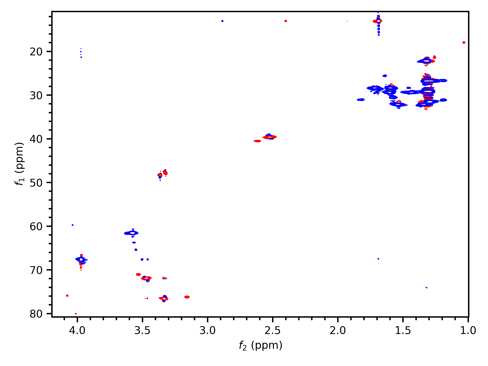
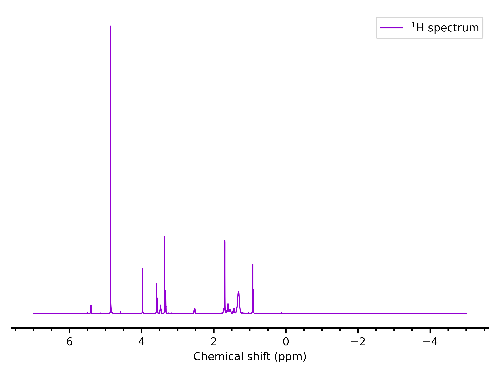

Quickstart
==========

Importing a spectrum
--------------------

Importing spectra is done with :func:`~penguins.read`. :func:`~penguins.read` takes three parameters: the path to the *spectrum folder*, the expno, and the procno. This returns one of several possible ``Dataset`` objects, depending on the dimensionality of the spectrum selected::

   >>> import penguins as pg
   >>> hsqc_ds = pg.read("data/rot1", 3, 1)
   >>> hsqc_ds
   Dataset2D('/Users/yongrenjie/penguins/tests/data/rot1/3/pdata/1')

(If you are not familiar with TopSpin's directory layout yet, see :doc:`topspin`.) Note that there is no support for 3D or higher spectra.

Spectral parameters (both acquisition and processing) can be accessed via their TopSpin names using dictionary-like syntax::

   >>> hsqc_ds["ns"]
   16
   >>> hsqc_ds["td"]   # see also "Non-Uniform Sampling"
   array([ 128, 2048])
   >>> hsqc_ds["si"]
   array([1024, 2048])
   >>> hsqc_ds["nuc1"]
   ('13C', '1H')

For 2D spectra, parameters which have values in both the indirect and direct dimensions are stored as either a tuple or a :class:`numpy.ndarray`, depending on whether the underlying values can be coerced to a float or not. Some parameters (such as those above) only make sense as ints, and those are stored as ints, not floats.

The first element is always the value for the indirect (*f*:subscript:`1`) dimension, and the second element the value for the direct (*f*:subscript:`2`) dimension.

There are a number of other functions that can be performed on Dataset objects: please see :doc:`datasets` for more details. However, **penguins does not aspire to be a NMR spectrum processing suite**. Consequently, it does not possess any functionality dealing with raw data.

Plotting spectra
----------------

Plotting is done in three stages. These are described in greater detail at :doc:`paradigm`. A brief summary is as follows:

1. *Stage* the spectrum (or spectra) to be plotted.

   Options that are specific to each individual spectrum, such as the range of chemical shifts to be plotted, legend labels, colours, etc. are specified at this stage. This uses the :meth:`~penguins.dataset.Dataset1D.stage()` methods on 1D and 2D ``Dataset`` objects.

2. *Construct* the plot.

   Options that affect the entire plot, such as horizontal/vertical offset between spectra, axis labels, etc. are specified at this stage. This uses the :func:`~penguins.pgplot.mkplot()` function.

3. *Display* the plot.

   You can either display the window using :func:`~penguins.show()`, or save a figure using :func:`~penguins.savefig`. Both act as wrappers around the corresponding ``matplotlib`` functions.

An example::

   # Staging, using the 2D dataset we read in earlier
   hsqc_ds.stage(f1_bounds="11..81",        # "lower..upper"
                 f2_bounds=(1, 4.2),        # tuples also acceptable as bounds
                 colors=("blue", "red"),    # (positive, negative)
                 )
   # Construct
   pg.mkplot()
   # Display
   pg.show()

will give the following inset of the HSQC:

This dataset has somewhat poor signal-to-noise, and the automatically chosen contour levels are slightly suboptimal. For 2D spectra, contour levels can be manually specified using the parameter ``levels`` in :meth:`~penguins.dataset.Dataset2D.stage()` (see also: :ref:`baselev`).

An example of a 1D plot is as follows::

   # Staging
   prot = pg.read("data/rot1", 1, 1)
   prot.stage(bounds="..7",                # or "bounds=(None, 7)": means no lower bounds
              color="darkviolet",
              label=r"$\mathrm{^{1}H}$")   # using some LaTeX syntax
   # Construct and display
   pg.mkplot; pg.show()

From here, you may want to consider reading :doc:`paradigm` to get to know penguins' overall approach to plotting.
Alternatively, to see the full range of options for 1D and 2D plotting, visit :doc:`plot1d` and :doc:`plot2d`.
Finally, there are some (relatively) advanced examples of plotting in the :doc:`cookbook`.
