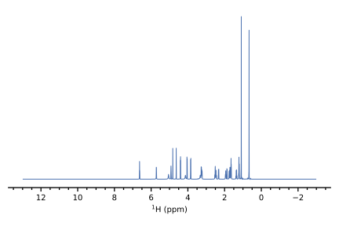

Tutorial 2: Plotting data
=========================

First, make sure you have some data on hand.
If you came here from the :doc:`previous tutorial </tutorials/read>`, we will reuse the ``data_1d`` and ``data_2d`` objects that were previously imported.

Plotting spectra using penguins is accomplished through three distinct steps:

1. **Staging**. In this step, a spectrum (i.e. the dataset returned by `read()`) is associated with an |Axes| which it will be plotted on.

   *Individual spectrum-level options* (e.g. the plot bounds and line colour) are specified here.

2. **Construction**. Here, all the spectra that were previously staged on a particular |Axes| are plotted.

   *Plot-level options* (e.g. horizontal / vertical separation between spectra, and axis labels) are specified here.

3. **Display**. The plot just needs to be displayed, and that's what we do here.

We will now illustrate each of these steps using a basic example.
If you are interested in a more in-depth description of how these stages relate to matplotlib, you may want to check out `../explanations/paradigm`.

.. note::
   If this is your first experience with matplotlib, I suggest checking out some of the `introductory matplotlib tutorials <https://matplotlib.org/tutorials/index.html>`_.
   For basic plots, it is not necessary to understand matplotlib in any detail at all.
   However, penguins' plotting functions are merely a *wrapper* around matplotlib: it only tries to *extend* the existing matplotlib functionality to NMR spectra, rather than incorporating all of matplotlib into itself.
   So, knowing a little bit of matplotlib will allow you to customise plots and plot layouts in ways which cannot be done purely in penguins.

---------------------------

A minimal 1D example
--------------------

**Staging** in general simply refers to calling the ``stage()`` method on the Dataset objects::

    >>> data_1d    # we imported this in tutorial 1
    Dataset1D('/Users/yongrenjie/penguins/tests/nmrdata/1/pdata/1')
    >>> data_1d.stage()

This doesn't produce any visible output (yet); what it *has* done is it has "registered" the spectrum above, so that it will be plotted in the future.

**Construction** uses the `mkplot()` function::

    >>> pg.mkplot()
    (<Figure size 600x400 with 1 Axes>, <AxesSubplot:xlabel='$\\rm ^{1}H$ (ppm)'>)

When we call `mkplot()`, we can see from the output that a |Figure| and an |Axes| (technically an ``AxesSubplot``) have been set up for us.
The *x*-axis label of the plot has automatically been set to a string which renders as $\mathrm{^1H~(ppm)}$.

Finally, **display** the plot using `show()`::

    >>> pg.show()

Once you type this, the 1D plot below should be displayed in a new window.
You can manipulate this plot, zoom in/out, or save it as a picture using the various buttons available.

As you may expect, penguins provides a number of options that can be passed in order to customise these plots.
These will be described shortly in `customise_1d`, but before that, a quick 2D example.

---------------------------

A minimal 2D example
--------------------

2D spectra are plotted in exactly the same way::

    >>> data_2d   # we imported this earlier, too
    Dataset2D('/Users/yongrenjie/penguins/tests/nmrdata/2/pdata/1')
    >>> data_2d.stage()
    >>> pg.mkplot()
    (<Figure size 500x500 with 1 Axes>, <AxesSubplot:xlabel='$\\rm ^{1}H$ (ppm)', ylabel='$\\rm ^{1}H$ (ppm)'>)
    >>> pg.show()

.. image:: 2d_example.svg
   :align: center

Notice that the |Axes| is set to a square shape: penguins does this automatically for 2D spectra.
However, there are some aspects of this plot which are clearly undesirable.
In `customise_2d` we will see how to improve it.
